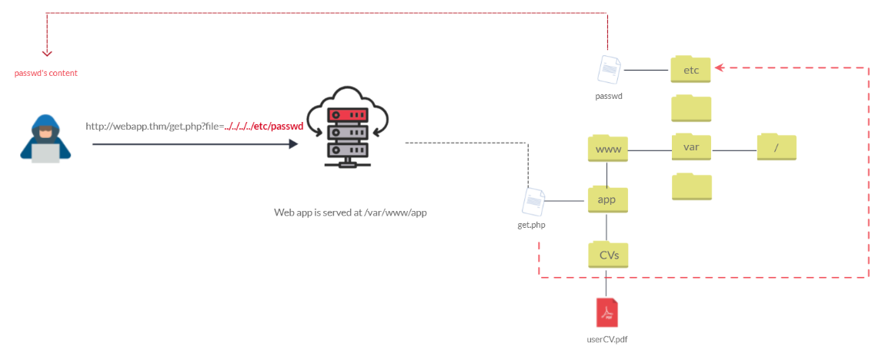

## File Inclusion

Exploit by pushing files to the web.

### Introduction

To send file to http web we can try
    `http://webapp.thm/get.php?file=userCV.pdf`

      - here, file is the parameter
      - and, userCV.pdf is the required file to access

### Path Traversal

Directory Traversal

- Allows user to read Operating system resources such as Local files
- Attacker can manipulate web application’s URL to access files on local system even outside the current directory
- It occurs when user’s inpu is passed to function such as file_get_contents in PHP.
- However, function isn’t the main contributor to the exploit

The following graph shows how a web application stores files in /var/www/app. The happy path would be the user requesting the contents of userCV.pdf from a defined path /var/www/app/CVs.

As we all know ../ steps 1 above the current directory. We can use of this method to roam around the web app.
In this example entry point is *get.php?file=*

### Local File Inclusion

Whenever a developer lacks awareness of security, he opens himself for Local File Inclusion attack. Most common vulnerable functions are *include, require, include_once and require_once*. Even though the example only shows PHP, other languages such as ASP, JSP and Node.js are also vulnerable to this exploit. LFI follows same concept as Path Traversal.
Let's go through some scenarios.

1. Different Languages, for example: EN and AR.

      ```<?PHP include($_GET["lang"]); ?>```
  
    The PHP above uses <mark>GET</mark> request using <mark>lang</mark> parameter. It can be called by sending the HTTP request: `http://webapp.thm/index.php?lang=EN.php` to load English page or `http://webapp.thm/index.php?lang=AR.php` tp load Arabic, where EN.php and AR.php are in same folder.
    If there is no input validation, theoretically we can access any file in the system. If we want to read `/etc/passwd` file, which contains sensitive information about the users of that Linux OS we can try: `http://webapp.thm/get.php?file=/etc/passwd`
    This works here beacuse there isnt a directory specified in the <mark>include</mark> function.

2. Now in next one Developer decided to specify directory inside the function.

    ```<?PHP include("languages/".$_GET["lang"]); ?>```

3.  

Source: `https://tryhackme.com/room/fileinc`
