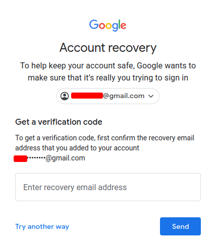

### OSINT
	Open Source Intelligence

### Email OSINT
	Email Discovery
- hunter.io
- phonebook.cz
- voilanorbert.com
- Clearbit - Chromium Plugin
- tools.verifyemailaddress.io (Verify Email Address)

Use _Forgot Password_ to tie email accounts.

In this way a recovery email can be tied to another email address.

---

### Password OSINT

##### Credentials Stuffing
	Automate Prevoiusly found username & Passwords

##### Dehashed
	Hunting Breached Credentials with DeHashed

---
### Find Subdomains 
	*.domain.com
* Sublist3r
	* `python3 sublist3r.py -d domain.com`
* Owasp
* Tomnomnom

---
### Build and Frameworks
	Know how website is built

- builtwith.com
- wappalyzer (Firefox Plugin)

---
### Traffic Interception
	Web Proxy

##### Burpsuite
~~~
Setup
---
- Change DNS Proxy to manual
- ip: 127.0.0.1    Port: 8080
- visit: https://burp
- Download Certificate
- Go To Firefox Privacy & Security
	- view certs
	- upload and select both
	- check boxes and OK.
~~~

~~~ 
Installed
- Turn on Intercept
- Check Website from Browser
- Turn off intercept
- Check Through Data
~~~
